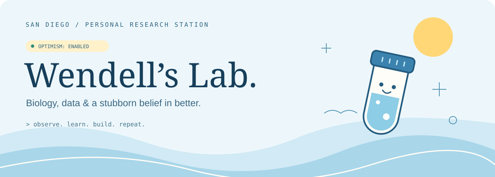

<p align="center"></p>

<p align="center">
  <a href="https://www.linkedin.com/in/wendelll/">LinkedIn</a> ·
  <a href="https://github.com/Wendelllllll/seqforge-order-system-v2">What I'm building</a> ·
  <a href="mailto:wendellwang468@gmail.com">Say hello</a>
</p>

## Hi, I'm Hao Jose Wang. Call me Wendell. 🌊

**Biology trained me to experiment. Data taught me to question. Optimism keeps me building.**

I'm based in San Diego, working across biology, data, and software. My path runs from molecular biology and drug discovery to a master's in data science — and now to building tools around real laboratory needs.

I like a good question, a useful prototype, and the possibility that the next experiment will teach us something.

```python
class Wendell:
    habitat = "San Diego, CA"
    background = ["molecular biology", "data science", "drug discovery"]
    current_experiment = "Making laboratory workflows feel simpler"
    optimism = True

    def when_things_break(self):
        return "Observe. Learn. Try again."
```

### 🧬 From the bench to the terminal

| Chapter | What I worked on |
| :--- | :--- |
| **UC San Diego · M.S. Data Science** | September 2024 – June 2026 · GPA 4.0/4.0 |
| **UC Riverside · B.S. Molecular Biology** | September 2021 – August 2023 · cum laude |
| **BeiGene · R&D Intern → Scientist I** | Cancer-cell experiments, NGS sample preparation, TP53 mutation screening, and drug-response analysis |
| **Nan Hao Lab · UC San Diego** | Yeast research, single-cell time-lapse imaging, and image-processing / quality-control workflows |
| **Meng Chen Lab · UC Riverside** | Plant signaling research, genotyping, and quantitative confocal-image analysis |

### 🛠️ On my workbench

**[SeqForge ordering platform ↗](https://github.com/Wendelllllll/seqforge-order-system-v2)**  
Turning sample submission, laboratory review, and result delivery into a connected workflow. Building with Next.js, TypeScript, and PostgreSQL. **Status: in development.**

**Clinical data → better questions**  
An observational analysis of 1,197 patients with type 2 diabetes, using Cox models to examine the association between SGLT2 inhibitor exposure and kidney-function decline.

**Spacecraft signals → unexpected patterns**  
Time-series anomaly detection on NASA telemetry, with careful separation of training and test data. Space is cool. Data leakage is not.

### 🔬 Things I reach for

**Code & data** — Python · R · MATLAB · SQL · Bash · pandas · NumPy · scikit-learn  
**Images & analysis** — OpenCV · ImageJ · GraphPad Prism · survival analysis · time series  
**At the bench** — Cell culture · NGS sample prep · PCR · genotyping · Western blotting · Sanger sequencing  
**Currently building with** — TypeScript · React / Next.js · PostgreSQL · Git

<details>
<summary><b>Open the lab notebook — a few nerdy footnotes</b></summary>

<br />

**Working hypothesis:** useful things start with curiosity and improve through iteration.

**Optimism protocol**
```text
unexpected result → inspect the evidence
broken prototype  → isolate the problem
next iteration    → bring snacks and curiosity
```

**A tiny sequence with an agenda**
```text
5′—ATG GCT AAA GAA—3′
    M   A   K   E
```
Four codons. One reminder: make something.

**Research notes**  
My résumé also includes conference abstracts on zanubrutinib (2025) and sonrotoclax (2026). Ask me about the path from a cell-culture experiment to an interpretable result.

</details>

---

<p align="center"><sub>Built with curiosity. Debugged with patience. Optimism under active development.</sub></p>
